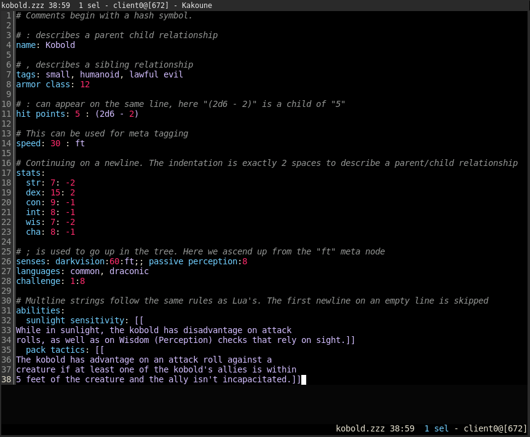

// SPDX-License-Identifier: 0BSD

= zzz.kak
:kak-repo: https://github.com/mawww/kakoune
:zzz-repo: https://github.com/gruebite/zzz

{kak-repo}[Kakoune] syntax highlighting for the {zzz-repo}[zzz data format].

Note that you may have to configure `indentwidth` to `2` for `filetype=zzz`.

[[screenshot]]

== License

This repository is licensed under the link:LICENSE[BSD 0-Clause License].
Third-party contributions shall be licensed the same unless explicitly stated otherwise.
